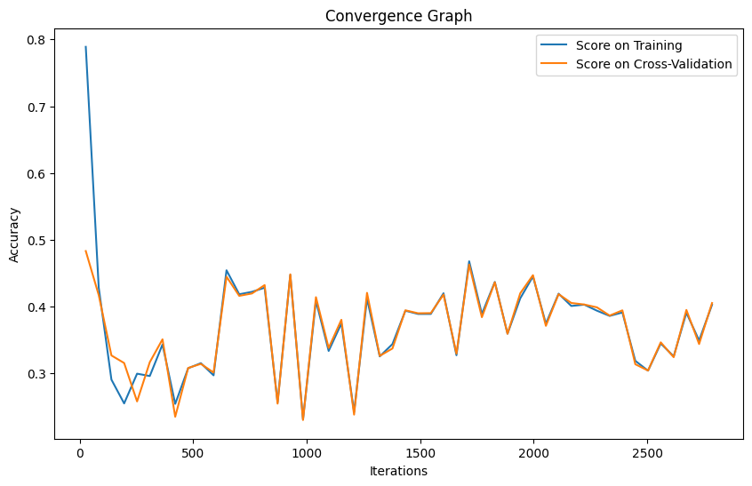

# Parameter Optimization (SVM)
### Submitted by: Eakansh Agarwal
### RollNo: 102103280
### Group 3CO10

Dataset Link: https://archive.ics.uci.edu/dataset/697/predict+students+dropout+and+academic+success

### Methodology
1. ***Data Preprocessing:***        
The dataset is loaded from a CSV file. Column names are standardized by removing leading/trailing whitespaces, converting to lowercase, and replacing spaces with underscores.Missing values are handled.
2. ***Label Encoding:***  The target variable is encoded using LabelEncoder to convert into numeric format.      
3. ***Feature Scaling:*** Standardization is applied to the feature variables using StandardScaler to bring them onto the same scale.      
4. ***Model Training and Evaluation:*** The dataset is split into training and testing sets using a 70-30 split and this process is repeated 10 times with different random states to generate multiple samples for cross-validation.For each sample, SVM models with different kernels (linear, poly, rbf, sigmoid) are trained with randomly chosen hyperparameters (kernel, C and gamma) using a custom fitness function based on accuracy score.The best performing model (with the highest accuracy) for each sample is recorded along with its hyperparameters. A DataFrame (result) is created to store the results (sample number, best accuracy, best kernel, best C value, best gamma value).    
Finally, the model with the best accuracy across all samples is selected and its learning curve is plotted to visualize the convergence of accuracy with respect to the number of training iterations.
5. ***Observations are as follows***:
   

